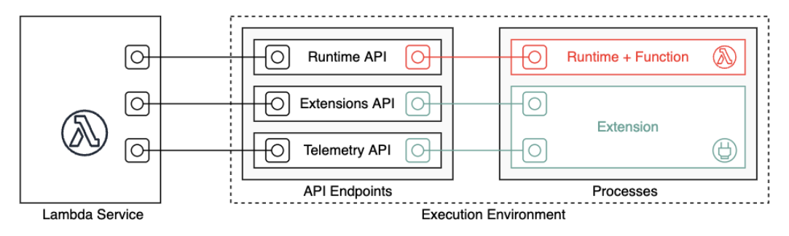
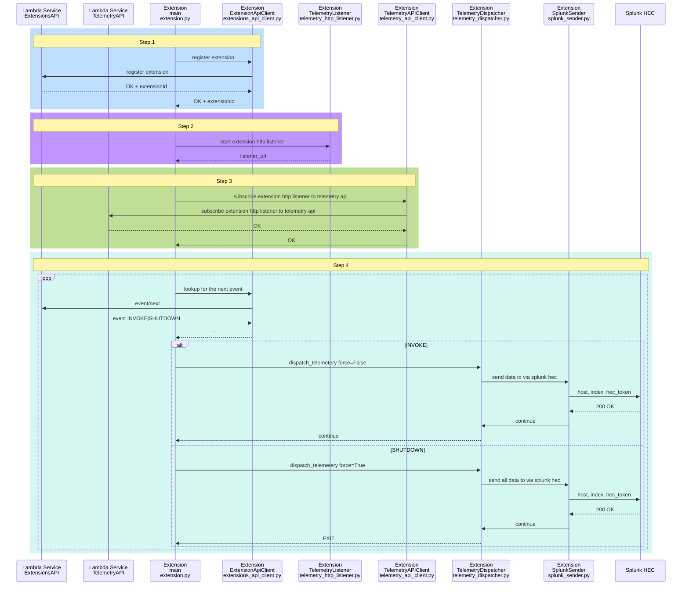
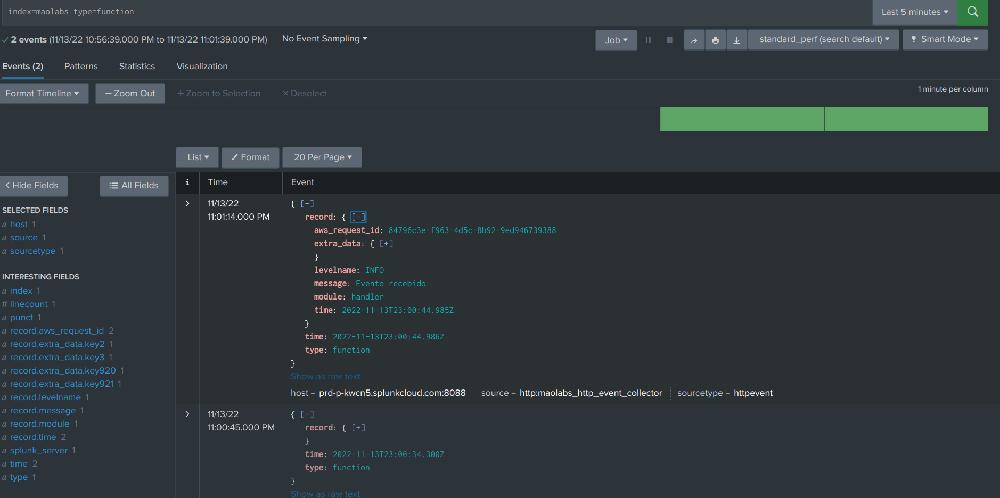

# AWS Lambda - Telemetry Api Extension - Exemplo de Envio para Splunk

Neste projeto exemplo são implementadas uma lambda function e uma extension que utiliza
a [Telemetry API](https://docs.aws.amazon.com/lambda/latest/dg/telemetry-api.html)
para enviar eventos de logs para o Splunk.



O diagrama de sequência a seguir demonstra o fluxo de execução:



Observe que a etapa 4 é assíncrona por natureza. As funções são descongeladas para processar
o evento de entrada e a nova telemetria pode chegar antes ou depois de despachar a telemetria
existente. No caso deste último, a telemetria recém-chegada será mantida na fila de telemetria
e despachada ao processar o próximo evento. Dependendo da configuração de buffer que você passa
para a API de telemetria durante a assinatura, você pode obter zero, uma ou várias solicitações
da API de telemetria para o ouvinte de telemetria em uma única invocação de função.

**Isso implica que em alguns momentos os logs só serão enviados no ciclo de SHUTDOWN da lambda function.**

Exemplo de logs recebidos no splunk:



## Terraform

O projeto utiliza terraform para implantar os recursos na AWS.

Para visualizar os logs também no cloudwatch, renomeie o arquivo `cloudwatch.tf.example` para `cloudwatch.tf`

As seguintes variáveis de ambiente foram convencionadas:

- SPLUNK_HOST: o host em que sua instancia do splunk está sendo executado
- SPLUNK_HEC_TOKEN: o token do [servico hec do splunk](https://docs.splunk.com/Documentation/Splunk/9.0.2/Data/UsetheHTTPEventCollector#Enable_HTTP_Event_Collector)
- SPLUNK_INDEX: o nome do índice criado no splunk
- DISPATCH_MIN_BATCH_SIZE: o tamanho mínimo de mensagens para ser enviado para o splunk.

Como são variáveis de ambiente do terraform, neste exemplo, devem ser declaradas com o prefixo "TF*VAR*".
Por exemplo: `export TF_VAR_SPLUNK_HOST=https://splunk.exemplo.com`

Para implantar os recursos, com o aws cli configurado e o terraform instalado, execute os comandos:

```bash
terraform init
terraform plan
terraform apply
```

## Sobre o Splunk

Para detalhes de criação de hec token:

https://docs.splunk.com/Documentation/Splunk/9.0.2/Data/UsetheHTTPEventCollector#Enable_HTTP_Event_Collector

Para detalhes de envio do payload para o serviço do splunk verifique:

https://docs.splunk.com/Documentation/Splunk/8.2.6/Data/FormateventsforHTTPEventCollector
